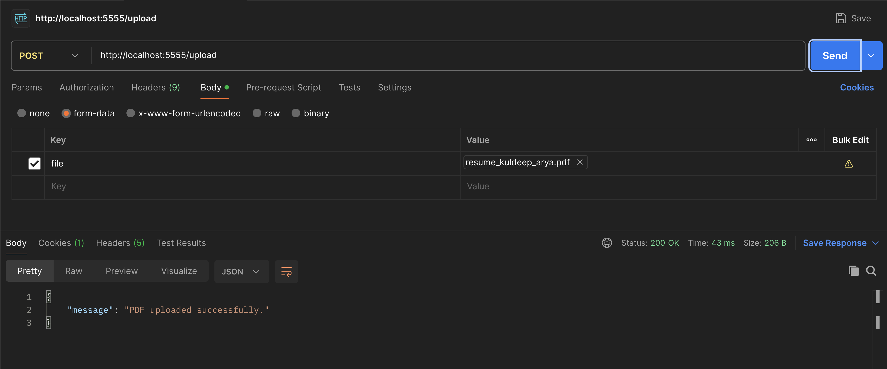
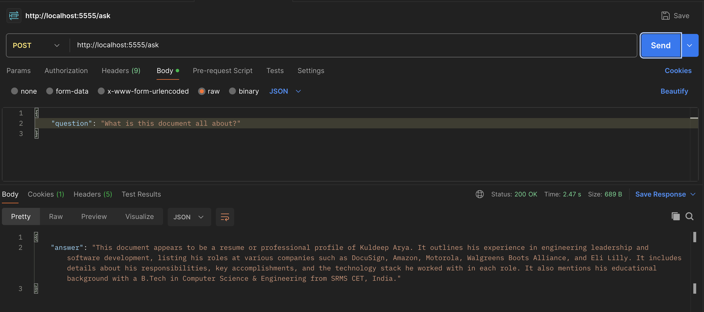

# What is this git repository all about?
This git repo is just to demonstrate one of the ways to build an AI assisted question and answer system. Here is the implemented functionality -
1. System allows user to upload a pdf file via /upload endpoint.
2. Once file is uploaded successfully, user can ask questions using /ask endpoint and system tries to answer it only based on that uploaded document.
3. Systems is expected to not respond to the questions that are not relevant to the uploaded document.

# How to build and run this code

### Step 1 - Enter your OpenAI API key in .env file
1. Create a .env file in the root directory (if it doesn't exist already)
2. Insert/Append a line to .env file such as the following - 
`OPENAI_API_KEY="sk-proj-your-key-goes-here"`

### Step 2 - Build Docker file.
`docker build -t rag_qa:latest .`

### Step 3 - Run docker container.
`docker run -d -p 5555:5555 --name rag rag_qa:latest`

### Step 4 - Upload PDF
#### Option 1 - Via python script
Upload a pdf document utilizing python script something like this - `python upload_sample_pdf.py`

#### Option 2 - Via postman

### Step 5 - Ask Question

#### Via postman

### Step 6 - Clean up by terminating the docker container.
`docker rm -f rag`

### Got any question/feedback
Feel free to reach out via [LinkedIn](https://www.linkedin.com/in/kuldeeparyadotcom/).
